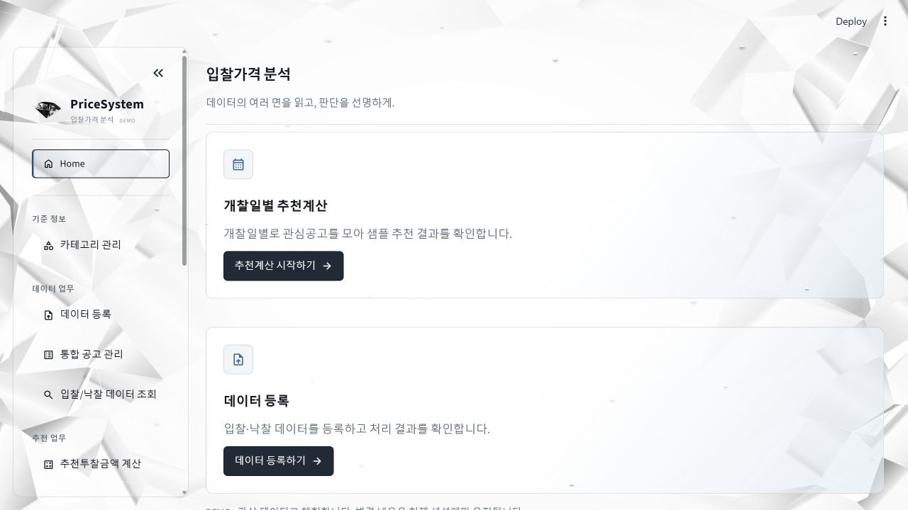
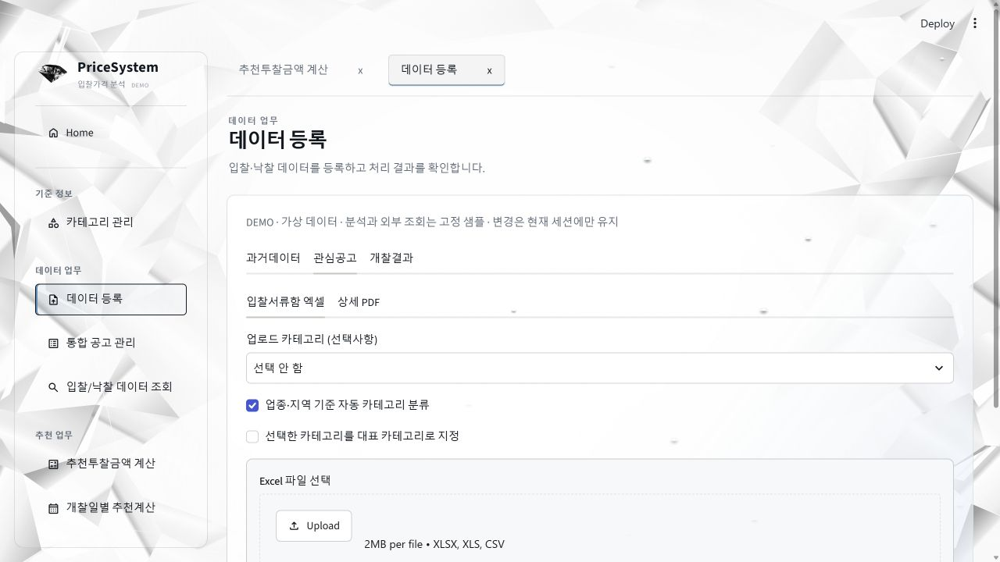
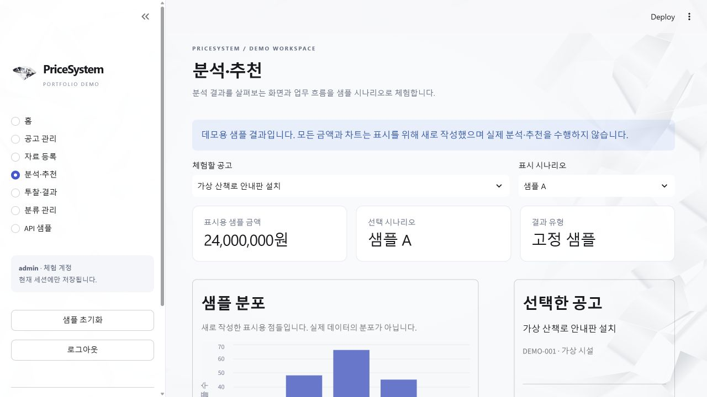
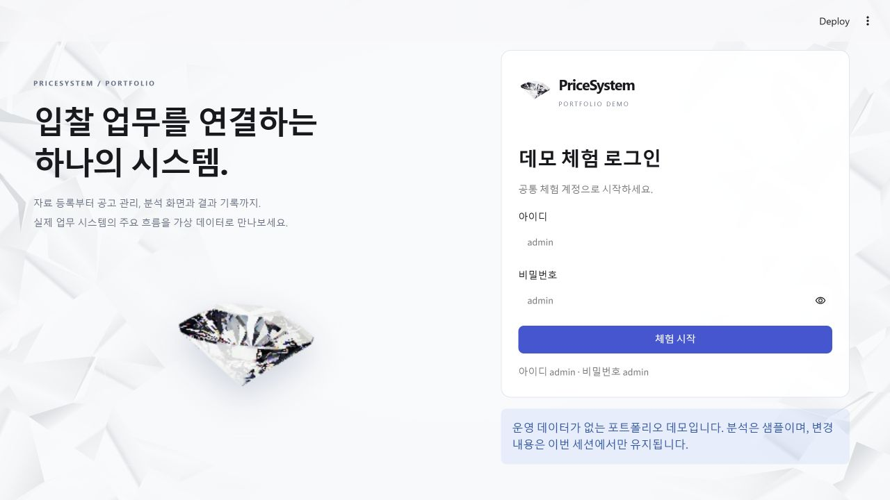
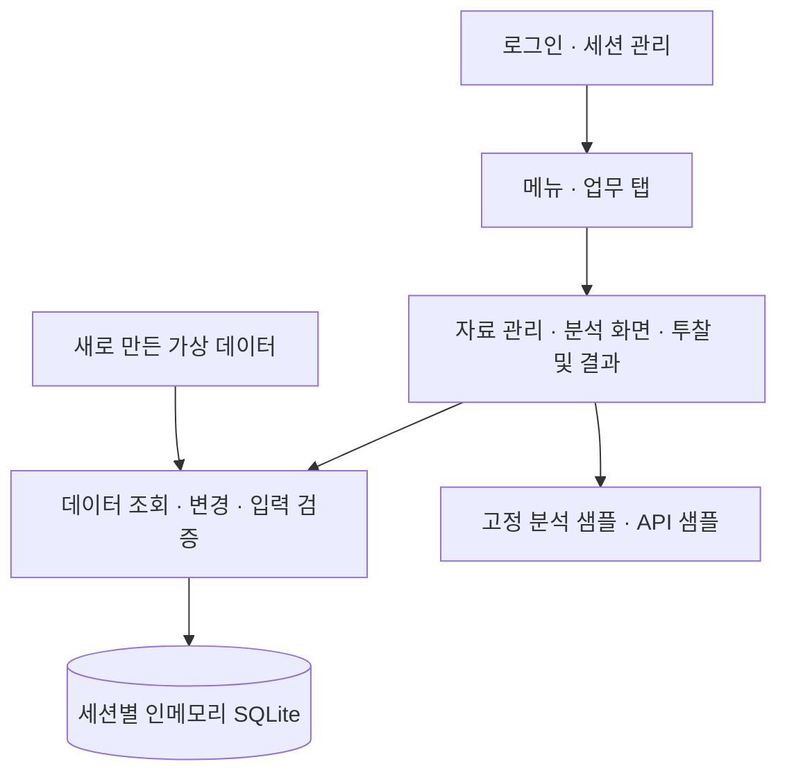

<div align="center">


# PriceSystem

### 입찰 업무의 흐름을 하나의 작업 공간으로

공고 등록 · 자료 조회 · 분석 화면 · 투찰 및 결과 관리

**Python · Streamlit · pandas · SQLite**

[화면 미리보기](#화면-미리보기) · [데모 체험](#데모-체험) · [빠른 시작](#빠른-시작) · [구현 포인트](#구현-포인트)

</div>

---

## 프로젝트 소개

PriceSystem은 공고와 관련 자료를 등록하고, 분석 화면을 거쳐 투찰 내역과 개찰 결과까지 관리하는 **입찰가격선정시스템**입니다. 실제 사용하는 운영 시스템의 화면 구성과 업무 흐름을 소개하기 위해, 독립적으로 실행할 수 있는 포트폴리오 데모를 만들었습니다.

이 저장소에서는 여러 업무 화면을 탭으로 오가며 데이터를 검색하고, 가상 공고와 투찰 기록을 직접 등록·수정·삭제할 수 있습니다. 기존 시스템의 메뉴와 화면 배치를 유지하면서, 운영 데이터와 비공개 기능에 연결되는 부분을 데모 전용 구성으로 분리했습니다.

> **먼저 확인해 주세요**
>
> 모든 업무 데이터는 데모를 위해 새로 만든 가상 샘플입니다. 분석·추천과 API 응답은 **고정된 시연용 결과**이며, 실제 계산식이나 실제 엔진의 출력값을 사용하지 않습니다. 체험할 때에도 개인정보나 실제 업무 자료 대신 가상 정보를 입력해 주세요.

## 화면 미리보기

### 홈과 업무 공간

업무 바로가기에서 필요한 화면을 열고, 여러 업무 탭 사이를 이동할 수 있습니다.



<details>
<summary><strong>자료 등록 화면 보기</strong> — 샘플 불러오기부터 선택 등록까지</summary>

과거데이터·관심공고·개찰결과를 나누어 확인하고, 샘플 자료를 미리 본 뒤 선택해 등록합니다.



</details>

<details>
<summary><strong>분석 화면 보기</strong> — 공고 선택과 추천 샘플 확인</summary>

공고를 선택하고 시연용 추천 결과를 확인합니다. 표시되는 금액은 실제 분석 결과가 아닌 고정 샘플입니다.



</details>

<details>
<summary><strong>로그인 화면 보기</strong> — 공개 체험 계정으로 시작</summary>



</details>

*모든 스크린샷은 이 데모의 가상 데이터로 촬영했습니다.*

## 데모 체험

[빠른 시작](#빠른-시작)에 따라 로컬에서 실행한 후 아래 계정으로 로그인하세요. 별도의 회원가입, API 키, 외부 DB는 필요하지 않습니다.

| 아이디 | 비밀번호 | 저장 방식 |
| :---: | :---: | --- |
| `admin` | `admin` | 현재 방문자의 세션 메모리에만 저장 |

처음에는 아래 순서로 둘러보는 것을 권합니다.

1. **공고 찾아보기** — `통합 공고 관리`에서 가상 공고를 검색하고 상세 내용을 확인합니다.
2. **자료 등록해 보기** — `데이터 등록`에서 샘플을 불러오고, 미리보기 후 원하는 항목을 등록합니다.
3. **분석 화면 살펴보기** — `추천투찰금액 계산`에서 공고를 선택하고 고정된 추천 샘플을 확인합니다.
4. **투찰과 결과 연결하기** — `나의 투찰관리`에서 가상 기록을 등록하고, `내 투찰현황`과 `결과 관리`에서 확인합니다.
5. **자유롭게 수정한 뒤 초기화하기** — 등록·수정·삭제를 체험한 다음 `샘플 초기화`로 처음 상태로 돌아갑니다.

### 데이터는 얼마나 유지되나요?

화면을 이동하는 동안에는 같은 세션의 데이터를 사용합니다. 변경 사항은 다른 방문자의 데이터에 반영되지 않으며, 업무 DB 파일로 저장하지 않습니다. **새 세션·로그아웃·샘플 초기화 시 기본 샘플로 돌아갑니다.** 새로고침이나 재접속 후에는 변경 내용이 유지되지 않을 수 있습니다.

## 주요 기능

| 업무 | 화면 | 데모에서 확인할 수 있는 기능 |
| --- | --- | --- |
| 분류 관리 | 카테고리 관리 | 분류·설명 등록, 수정, 삭제 |
| 자료 준비 | 데이터 등록 | 과거데이터·관심공고·개찰결과의 샘플 미리보기와 선택 등록 |
| 공고 관리 | 통합 공고 관리 | 검색, 상세 조회, 등록·수정·삭제, 출처 표시 |
| 자료 조회 | 입찰/낙찰 데이터 조회 | 조건별 검색과 상세 자료 확인 |
| 분석 화면 | 추천투찰금액 계산 | 공고 선택과 고정 추천 샘플 확인 |
| 일정별 분석 | 개찰일별 추천계산 | 날짜별 공고 선택, 샘플 결과 확인·저장 |
| 투찰 기록 | 나의 투찰관리 | 가상 회사의 투찰 기록 등록·조회·수정·삭제 |
| 현황 확인 | 내 투찰현황 | 투찰 기록과 샘플 결과 조회 |
| API 화면 | 나라장터 API 연동 | 외부 호출 없이 정상·빈 결과·오류 샘플 응답 확인 |
| 결과 정리 | 결과 관리 | 결과 자료 등록, 수기 수정, 표시용 추천 결과 확인 |

**파일 등록 체험:** Excel/PDF 화면은 `샘플 불러오기 → 미리보기 → 선택 등록` 흐름을 제공합니다. 선택한 파일의 실제 내용을 판독하지 않습니다. 표 다운로드는 Excel에서 열 수 있는 CSV 형식으로 제공합니다.

## 구현 포인트

이 데모에서는 계산 방식보다 **화면 구성, 데이터 관리, 모듈 간 역할 분리**를 중심으로 구현 내용을 확인할 수 있습니다.

| 구현 주제 | 구성과 의도 | 관련 모듈 |
| --- | --- | --- |
| 여러 업무 화면의 연결 | 메뉴·그룹·다중 업무 탭과 홈을 공통 작업 공간에서 관리 | `demo/workspace.py` |
| 업무별 화면 분리 | 자료 등록·조회 화면과 투찰·결과 화면을 나누어 구성 | `demo/data_pages.py`, `demo/bid_pages.py` |
| 공통 화면 요소 | 반복되는 UI 표현과 테마를 공통 모듈로 관리 | `demo/ui.py`, `demo/visual_components.py`, `demo/workspace_theme.py` |
| 데이터 처리 분리 | 조회·등록·수정·삭제와 입력 검증을 저장소 모듈에 모음 | `demo/store.py` |
| 방문자별 체험 공간 | 세션별 인메모리 SQLite로 데이터와 초기화 범위를 분리 | `app.py`, `demo/store.py` |
| 독립적인 샘플 서비스 | 분석·API 샘플과 가상 초기 데이터를 별도 구성 | `demo/services.py`, `demo/samples.py` |

### 구성 흐름



모듈의 상세 역할과 세션 경계는 [아키텍처 안내](docs/ARCHITECTURE.md)에 정리했습니다. 확인된 원본의 모듈 개발 기록과 데모 작업 범위는 [개발 안내](docs/DEVELOPMENT.md)에서 구분해 볼 수 있습니다.

## 빠른 시작

**Python 3.11 이상**과 Git이 필요합니다. 아래 명령으로 저장소를 받은 뒤 운영체제에 맞게 실행하세요. 주요 의존성은 `requirements.txt`에 고정되어 있습니다.

```bash
git clone https://github.com/inhaaa/PriceSystem-demo.git
cd PriceSystem-demo
```

### Windows PowerShell

```powershell
python -m venv .venv
.\.venv\Scripts\python.exe -m pip install -r requirements.txt
.\.venv\Scripts\python.exe -m streamlit run app.py
```

### macOS · Linux

```bash
python3 -m venv .venv
.venv/bin/python -m pip install -r requirements.txt
.venv/bin/python -m streamlit run app.py
```

터미널에 표시되는 로컬 주소를 브라우저에서 열고 `admin` / `admin`으로 로그인합니다. GitHub에서는 코드와 문서를 열람하며, 앱 체험은 위 명령으로 실행한 로컬 화면에서 진행합니다.

### 테스트 실행

가상환경을 활성화한 상태에서 실행합니다.

```bash
python -m unittest discover -s tests -t . -v
```

`tests/`에서는 CRUD, 입력 검증, 세션 초기화, 화면 동작 및 고정 샘플 서비스의 경계를 확인합니다. 실제 분석 엔진의 정확도나 운영 성능을 평가하는 테스트는 포함하지 않습니다.

## 공개 범위

| 이 저장소에 포함된 내용 | 비공개로 유지하는 내용 |
| --- | --- |
| 검토된 화면 구성·메뉴·공통 시각 요소 | 운영용 계정·권한·회사 설정 |
| 가상 데이터의 검색·필터·CRUD | 실제 사용자·회사·투찰·낙찰 데이터 |
| 명확히 표시한 분석·추천 고정 샘플 | 실제 계산식·가중치·보정값·판단 기준·백테스트 구현 |
| 외부 통신 없는 API 샘플 응답 | 실제 API 키·인증정보·외부 연동 설정 |
| 세션별 메모리 저장소와 테스트 | 운영 DB·백업·로그·운영 환경 설정 |

원본 운영 시스템의 개발 이력은 Private 저장소에 유지하며, 이 저장소는 데모 전용 이력으로 관리합니다. 원본 프로젝트나 비공개 모듈 없이 실행할 수 있고, 실제 계산으로 전환하는 설정이나 운영 경로 연결도 포함하지 않습니다.

## 더 알아보기

- [아키텍처 안내](docs/ARCHITECTURE.md) — 모듈별 역할, 데이터 흐름, 세션 경계
- [개발 안내](docs/DEVELOPMENT.md) — 확인된 개발 기록, 수정 위치, 검증 방법
- [자산 및 권리 안내](ASSET_NOTICE.md) — 코드·문서·디자인과 제3자 의존성의 이용 범위

포트폴리오 열람·평가와 데모 체험을 목적으로 공개합니다. 저장소 전체에 MIT 등의 포괄적 라이선스를 부여하지 않으며, 디자인 자산과 제3자 소프트웨어에는 각각의 권리와 이용 조건이 적용됩니다.
