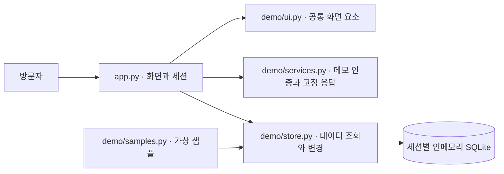

# PriceSystem

**공고 등록부터 분석 화면, 투찰·결과 관리까지 살펴보는 포트폴리오 데모**

실제 완성된 운영 시스템의 업무 흐름과 화면 구성을 소개하기 위해 별도로 만든 데모입니다. 방문자는 가상의 공고·회사·결과를 조회하고, 직접 추가·수정·삭제하면서 화면 간 연결을 확인할 수 있습니다.

> **데모 안내** — 모든 업무 데이터는 새로 만든 가상 샘플입니다. 분석·추천 값은 화면 시연용 고정 샘플이며 실제 분석 엔진의 출력이 아닙니다. 실제 업무 판단에 사용하거나 개인정보·영업정보 등 민감한 데이터를 입력하지 마세요.

| 데모 로그인 | 값 |
| --- | --- |
| 아이디 | `admin` |
| 비밀번호 | `admin` |
| 데이터 보관 | 방문자의 현재 세션 메모리에만 보관 |


<details>
<summary>분석 샘플 · 로그인 화면 보기</summary>


</details>

위 화면은 이 데모의 가상 데이터로 새로 캡처했습니다.

## 둘러보기

| 화면 | 체험할 수 있는 흐름 |
| --- | --- |
| 홈 | 샘플 업무 현황과 주요 화면 진입 |
| 공고 관리 | 가상 공고 조회·등록·수정·삭제 |
| 자료 등록 | CSV 템플릿 내려받기와 샘플 자료 가져오기 |
| 분석·추천 | 선택한 공고의 시연용 분석·추천 샘플 확인 |
| 투찰·결과 | 가상 투찰 및 결과 기록 관리 |
| 분류 관리 | 공고에 사용할 분류 관리 |
| API 샘플 | 외부 통신 없이 고정된 샘플 응답 확인 |

회사 정보는 가상의 회사명을 입력하는 방식으로 단순화했습니다. 계정은 공개된 데모 계정으로만 체험합니다.

## 빠른 시작

Python **3.11 이상**이 필요합니다. 주요 의존성은 Streamlit `1.59.2`, pandas `3.0.3`입니다. 저장소 폴더에서 실행하세요.

### Windows PowerShell

```powershell
python -m venv .venv
.\.venv\Scripts\python.exe -m pip install -r requirements.txt
.\.venv\Scripts\python.exe -m streamlit run app.py
```

### macOS · Linux

```bash
python3 -m venv .venv
.venv/bin/python -m pip install -r requirements.txt
.venv/bin/python -m streamlit run app.py
```

터미널에 표시되는 로컬 주소를 열고 `admin` / `admin`으로 로그인합니다. 가상환경을 활성화한 경우에는 `python -m streamlit run app.py`로 실행할 수 있습니다.

## 세션과 초기화

- 각 방문자의 데이터는 해당 Streamlit 세션에 연결된 **인메모리 SQLite**에 저장됩니다.
- 등록·수정·삭제한 내용은 현재 세션에서만 유지되며, 디스크의 업무 DB에 기록하지 않습니다.
- **새 세션·로그아웃·샘플 초기화** 시 기본 샘플 상태로 돌아갑니다. 새로고침이나 재접속 후 변경 내용 유지가 보장되지 않습니다.
- CSV 업로드도 현재 세션에만 반영됩니다. 데모 안에서 만든 가상 데이터로 체험하세요.

## 구성



구조는 [아키텍처 안내](docs/ARCHITECTURE.md), 검증 방법과 개발 범위는 [개발 안내](docs/DEVELOPMENT.md)에서 확인할 수 있습니다.

## 공개 범위

이 저장소는 UI와 데이터 관리 흐름을 시연합니다. 실제 분석 수식·전략·판단 기준, 운영 데이터, 외부 API 연결 및 인증 정보, 운영용 계정·권한·회사 설정은 포함하지 않습니다. API 화면은 네트워크를 사용하지 않는 샘플이며, 분석 결과 역시 실제 엔진의 정확도나 성능을 입증하지 않습니다.

원본 운영 시스템과 이 데모의 작업 범위는 [개발 안내](docs/DEVELOPMENT.md)에 구분해 기록했습니다. 배포 안정성이나 운영 성능을 검증했다는 의미는 아닙니다.

## 권리 안내

포트폴리오 열람·평가와 데모 체험을 목적으로 공개합니다. 디자인 자산과 제3자 의존성의 권리는 각각의 권리자에게 있으며, 저장소 전체에 MIT 등의 포괄적 라이선스를 부여하지 않습니다. 자세한 범위는 [자산 및 권리 안내](ASSET_NOTICE.md)를 확인하세요.
