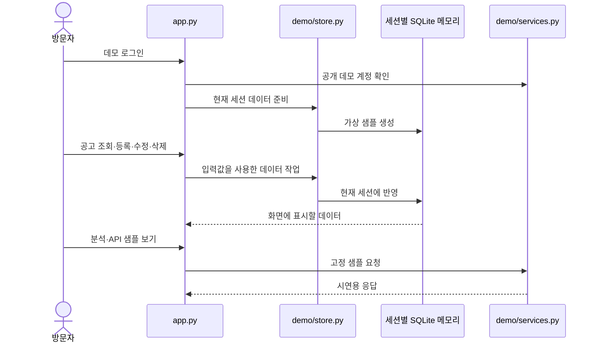

# 아키텍처

PriceSystem 데모는 화면·서비스·저장소를 작은 모듈로 나눕니다. 실제 업무 흐름을 체험할 수 있도록 CRUD는 동작하게 하고, 운영 분석과 외부 연동은 고정 샘플로 표현합니다.

## 모듈의 역할

| 경로 | 책임 |
| --- | --- |
| `app.py` | 로그인, 탭 구성, 사용자 입력, 세션 상태 연결 |
| `demo/ui.py` | 공통 시각 요소와 화면 표현 |
| `demo/store.py` | 인메모리 SQLite 생성, 조회·등록·수정·삭제, 초기화 |
| `demo/samples.py` | 데모를 위해 새로 만든 가상 샘플 데이터 |
| `demo/services.py` | 데모 계정 확인, 시연용 분석·API 샘플 응답 |
| `assets/` | 데모에 포함한 검토된 시각 자산 |
| `tests/` | 데이터 동작 및 서비스 경계를 확인하는 테스트 |

## 데이터 흐름

## 세션 경계

SQLite 연결은 방문자의 현재 세션에서 사용합니다. 데이터 변경은 다른 방문자의 샘플에 반영되지 않으며 영구 보존되지 않습니다. 새 세션, 로그아웃, 샘플 초기화는 기본 가상 데이터로 시작하는 경계입니다.

화면이 다시 실행되는 일반적인 Streamlit 상호작용과 새로운 세션은 구분됩니다. 현재 세션이 유지되는 동안의 화면 조작은 같은 데이터를 사용하지만, 새로고침이나 재접속 후 상태 복구를 제공하지 않습니다.

## 데모 서비스의 경계

- 공개 데모 계정은 화면 체험을 위한 진입 장치입니다. 운영용 인증·권한 체계는 구현 범위에 포함하지 않습니다.
- 분석·추천은 미리 정의한 샘플을 표시합니다. 실제 수식이나 전략을 실행하지 않습니다.
- API 샘플은 메모리의 고정 응답을 사용합니다. 외부 서비스 요청, API 키, 외부 데이터 수집은 없습니다.
- CSV는 제공되는 템플릿의 입력 계약을 따라 현재 세션으로 가져옵니다. 운영 파일이나 민감한 자료를 업로드하지 않습니다.
- 회사와 사용자 관리의 운영 설정은 가상 회사명 입력과 단일 데모 계정으로 단순화했습니다.

이 구조는 포트폴리오 체험의 범위를 설명합니다. 운영 환경의 보안·확장성·성능을 보장하는 참조 아키텍처로 제시하지 않습니다.
